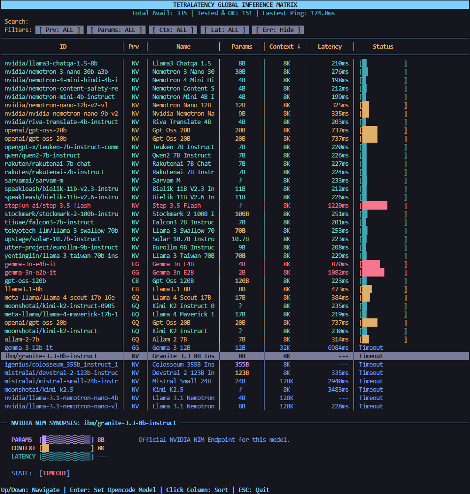

# TetraLatency (`tlate`)
A TUI for benchmarking LLM latency across different providers in real-time.



## Overview
I built `tlate` because I needed a quick way to see which LLM providers were performing best at any given moment. It pings a list of models concurrently and shows real-time latency so you can find the fastest path for your agents.

If you use **OpenCode**, you can select a model and hit `ENTER` to immediately update your agent configuration to use that model.

## Supported Providers
Supports most providers with free tiers:
- NVIDIA NIM
- Groq
- Cerebras
- Google Gemini
- Mistral / Codestral
- Cohere
- OpenRouter

## Installation
### Prerequisites
- Node.js (v18+)
- Python (v3.10+)

### Setup
```bash
git clone https://github.com/tetraxp/TetraLatency.git
cd TetraLatency
npm link
```

## Configuration
The tool automatically detects keys from `~/.local/share/opencode/auth.json`. Alternatively, you can export them as environment variables:

```bash
# Core Providers
export NVIDIA_API_KEY="your_key"
export OPENROUTER_API_KEY="your_key"
export GROQ_API_KEY="your_key"
export GEMINI_API_KEY="your_key"
export CEREBRAS_API_KEY="your_key"
export MISTRAL_API_KEY="your_key"
export CODESTRAL_API_KEY="your_key"
export COHERE_API_KEY="your_key"
```

## Controls
- **Arrows**: Navigate the list
- **Enter**: Apply the selected model to your OpenCode/Oh-My-OpenCode config
- **Click Headers**: Sort by Latency, Params, Context, etc.
- **Type**: Live search and filtering
- **ESC / Q**: Quit

## License
MIT
